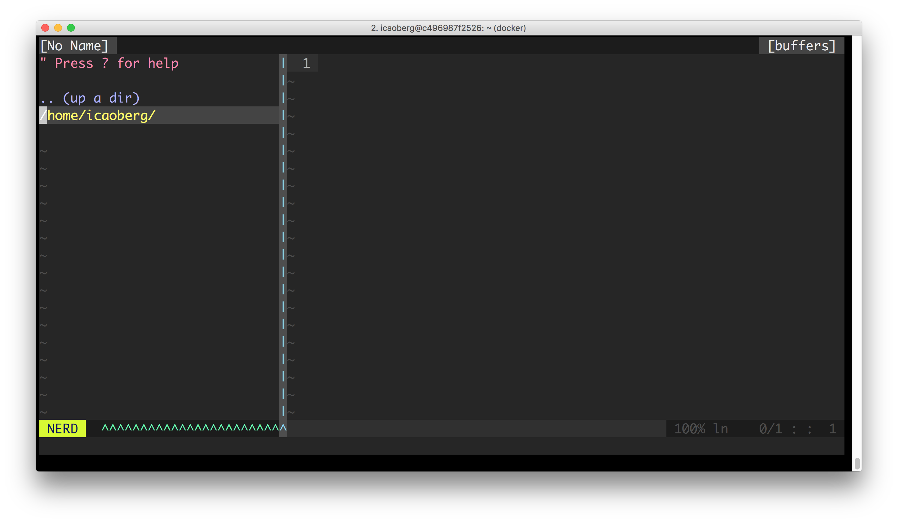

# docker-vim

[](https://travis-ci.org/icaoberg/docker-vim)
[](https://github.com/icaoberg/docker-vim/issues)
[](https://github.com/icaoberg/docker-vim/network)
[](https://github.com/icaoberg/docker-vim/stargazers)
[](https://www.gnu.org/licenses/quick-guide-gplv3.en.html)



To build an image using the `Dockerfile` in this repository, run the command

```
➜ docker build -t "icaoberg/vim" .
```

The result is

```
➜  docker images
REPOSITORY          TAG                 IMAGE ID            CREATED             SIZE
icaoberg/vim        latest              9707c871c18b        About an hour ago   455MB
ubuntu              latest              0458a4468cbc        2 days ago          112MB
```

To run a container using the image above

```
➜  docker run -i -t icaoberg/vim
icaoberg@7312b0fb2f54:~$
```
